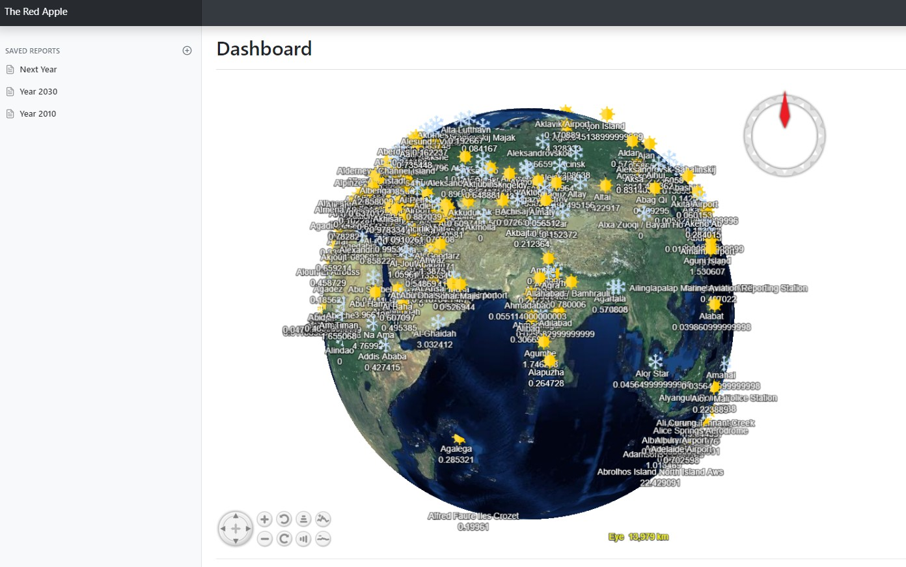

# red-apple
The Red Apple of the Future

We want to use NASA and Internet to show the future of the weather
I worked with apple, not Apple that sells iPhone and iPad but a business that plants, produces and exports apples 🍎.

Cultivate red apples (like this one 🍎) needs a special weather and where once you could plant red apples, now we can't. However, it is not a bad as it looks, red apples are planted in a different location (south of Chile).

Our project is to measure it visually, and for this task, we will use the tool supplied by the NASA.

But, It is not only about red apples but about the ecology and economy of our world. Can we predict the future for a specific location?. Let's find it out.

## Instructions

* Install the MYSQL 8.x database (the default user is root/abc.123)
* The dump of the database is on mysql/weather.sql
* Add the libraries (using PHP Composer)
* The webpage is on example/nasa.php
